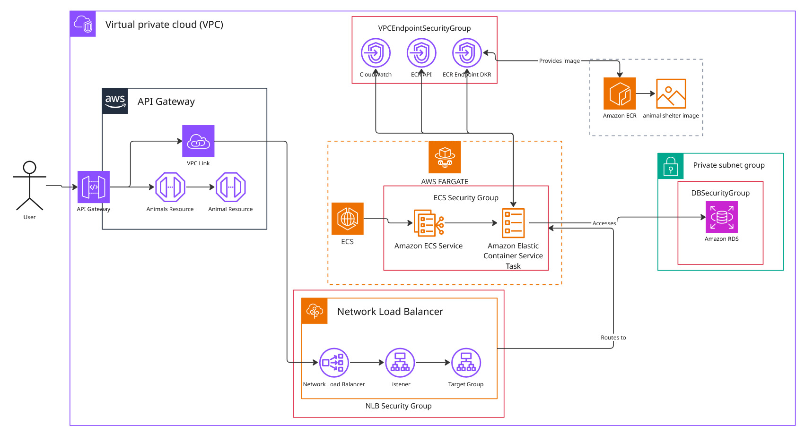
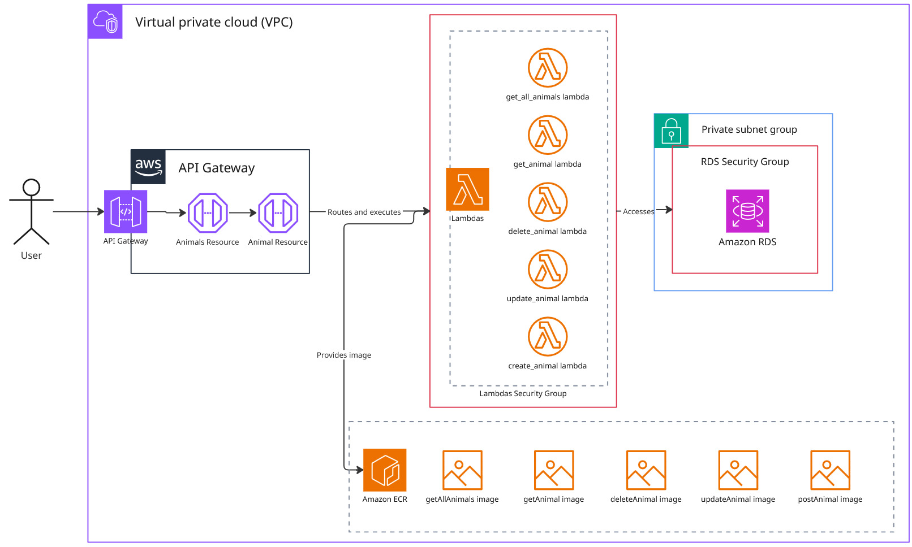

# Animal Shelter API - Diseño de Aplicaciones en la Nube

Este proyecto despliega una API REST para gestionar un refugio de animales en AWS. Incluye dos arquitecturas diferenciadas: una **acoplada** basada en contenedores ECS Fargate y otra **desacoplada** basada en funciones Lambda serverless.

## Arquitecturas

### Versión acoplada (ECS Fargate)

El backend se ejecuta como un servicio unificado en un contenedor Docker dentro de ECS Fargate. El flujo es el siguiente:

1. **API Gateway** expone los 5 endpoints REST y autentica las peticiones con API Key.
2. **VPC Link + Network Load Balancer (NLB)** enrutan el tráfico hacia las tareas ECS en subnets privadas.
3. **ECS Fargate** ejecuta la aplicación Node.js/Express que implementa la lógica CRUD.
4. **Amazon RDS (PostgreSQL)** persiste los datos, sin acceso público.
5. **VPC Endpoints** permiten que ECS descargue imágenes de ECR y envíe logs a CloudWatch sin salir de la VPC.

### Versión desacoplada (Lambda)

La lógica se divide en 5 funciones Lambda independientes, una por operación. El flujo es:

1. **API Gateway** recibe la petición y la enruta directamente a la función Lambda correspondiente.
2. **AWS Lambda** ejecuta la operación concreta: `get_all_animals`, `get_animal`, `create_animal`, `update_animal` o `delete_animal`.
3. **Amazon RDS (PostgreSQL)** es la base de datos común para todas las funciones.
4. **Amazon ECR** almacena las imágenes Docker de cada función Lambda.

## Estructura del proyecto

- `frontend.html`: interfaz web básica para conectarse a la API usando la URL y la API Key.
- `acoplado/`: backend Node.js con Express, Docker, RDS PostgreSQL y despliegue sobre ECS Fargate.
- `desacoplado/`: backend dividido en funciones Lambda empaquetadas como imágenes Docker, con RDS PostgreSQL compartido.
- `Insomnia_2025-11-09.yaml`: colección de peticiones para probar los endpoints.

## Requisitos previos

- **AWS CLI v2** instalado y configurado (`aws configure`).
- **Docker** en ejecución.
- **PowerShell** para ejecutar el script automático de despliegue de la versión desacoplada.
- **Rol IAM `LabRole`**: necesario para los permisos de CloudFormation. En cuentas personales, créalo o modifica las plantillas.

## Despliegue

### Versión acoplada

1. **Crear el repositorio ECR** desplegando `acoplado/ecr-acoplado.yml` en CloudFormation (seleccionar `LabRole`).
2. **Subir la imagen Docker**: desde la carpeta con el `Dockerfile`, ejecutar los 4 comandos que aparecen en *Ver comandos de envío* dentro del repositorio ECR en la consola AWS.
3. **Desplegar la infraestructura** con `acoplado/main_mas_db.yml` en CloudFormation, rellenando los parámetros (nombre/contraseña de DB, Subnets, VPC ID y Route Table ID).
4. **Probar la API** abriendo `frontend.html` e introduciendo la URL del API Gateway y la API Key (ambas visibles en el panel de API Gateway).

### Versión desacoplada

1. **Crear imágenes y subirlas al ECR**: ejecutar `desacoplado/deploy-lambdas.ps1` en PowerShell. El script crea los repositorios, construye las 5 imágenes y las sube automáticamente.
2. **Desplegar la base de datos** con `desacoplado/db_postgres.yml` en CloudFormation (Subnets, VPC ID y contraseña).
3. **Desplegar la infraestructura principal** con `desacoplado/main-lambda.yml`, usando el endpoint de RDS del output de la pila anterior como parámetro `DBHost`.
4. **Probar la API** con `frontend.html`, Postman, Insomnia o curl, usando la URL y API Key del panel de API Gateway.

> [!WARNING]
> Todos los recursos se crean en la región configurada en AWS CLI. Asegúrate de usar siempre la misma región en todos los pasos.

## Testing

Las pruebas se realizaron con **Insomnia**. La colección de peticiones lista para importar se encuentra en el archivo `Insomnia_2025-11-09.yaml` del repositorio; solo hay que actualizar la URL base y la API Key.

También se puede usar el `frontend.html` incluido para probar las operaciones CRUD de forma interactiva.

## Comparativa de costes

| | Acoplada (ECS) | Desacoplada (Lambda) |
|---|---|---|
| **Coste mensual** | ~73,52 USD | ~29,44 USD |
| **Coste anual** | ~882,24 USD | ~353,28 USD |

La versión desacoplada es significativamente más económica al ejecutarse solo bajo demanda, sin recursos permanentemente activos.